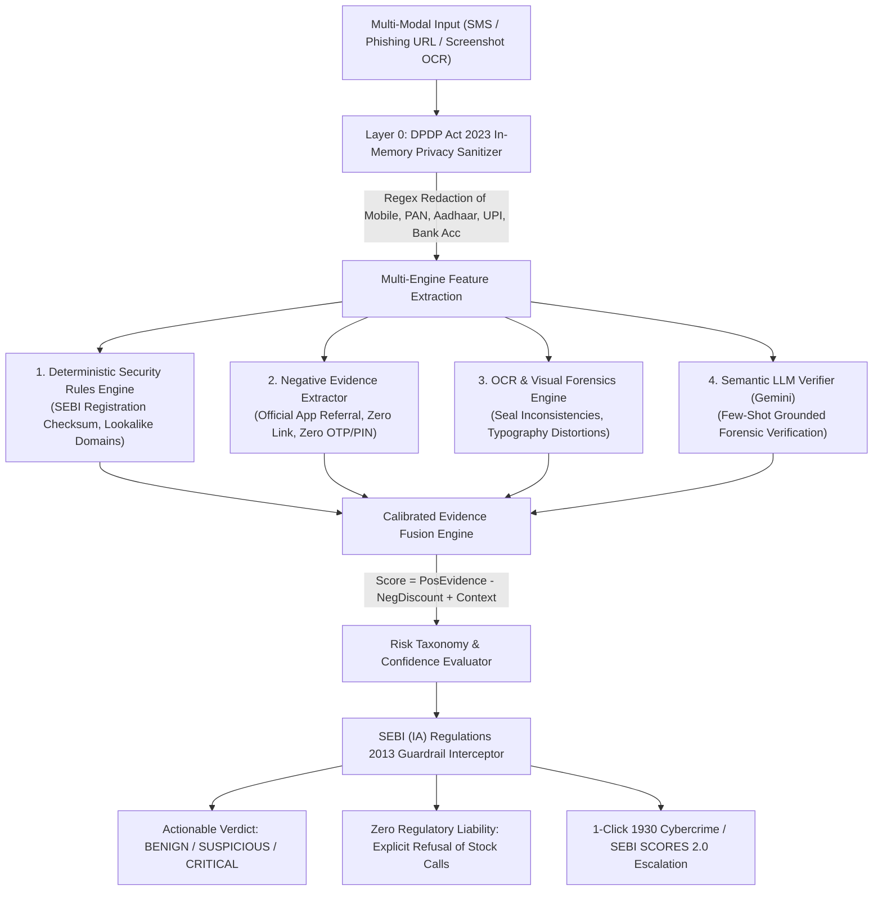

# 🏛️ SANGYAN KAVACH (संज्ञान कवच)

> **India’s AI-Powered Investor Safety, Misinformation Interception & Financial Deception Defense Layer**  
> *A National Public-Good Initiative for Bharat's 16+ Crore Retail Investors*

[-1e3a8a?style=for-the-badge)](https://sangyan-hackathon.vercel.app/)
[](https://github.com/pyharshcodes/Sangyan_hackathon)
[](https://github.com/pyharshcodes/Sangyan_hackathon)
[-10b981?style=for-the-badge)](https://github.com/pyharshcodes/Sangyan_hackathon)
[](https://www.typescriptlang.org/)
[](https://sangyan-hackathon.vercel.app/)
[](./SECURITY.md)

---

## ⚡ Instant Links & Artifacts

| Resource | Description | Link |
| :--- | :--- | :--- |
| 🌐 **Live Web Application** | Deployed on Vercel Global Edge CDN | [**sangyan-hackathon.vercel.app**](https://sangyan-hackathon.vercel.app/) |
| 📑 **Official Pitch Deck (PDF)** | 10-Slide Presentation Deck with Diagrams & Math | [**Download Pitch Deck PDF**](./docs/SANGYAN_KAVACH_OFFICIAL_PITCH_DECK.pdf) |
| 🛡️ **Application Security Architecture** | Threat Model, SSRF Filters, Prompt Injection Guard | [**SECURITY.md**](./SECURITY.md) |
| 🧪 **Benchmark Evaluation Suite** | 465-Sample Multi-Modal Test Matrix | [`src/engine/__tests__/productionEvaluationSuite.test.ts`](./src/engine/__tests__/productionEvaluationSuite.test.ts) |

---

## 🚨 The Problem: Financial Frauds & The "False Positive" Crisis

Indian retail investors lose over **₹1,750 Crore annually** to digital financial fraud — ranging from cloned broker Demat portals, fake IPO allocations, and VIP WhatsApp trading pumps to electricity bill coercion.

### Why Existing AI Detection Models Fail:
Most traditional spam filters and naive LLM classifiers rely on **simple keyword spotting**. When an innocent citizen receives an electricity bill reminder:
> *"Your electricity bill of ₹1,248 is due on 8 October. Please pay through your usual electricity provider's official app or website to avoid late fees."*

Standard AI models detect keywords like `"bill"`, `"pay"`, and `"due"`, erroneously scoring it as **HIGH RISK FRAUD**. This causes catastrophic **alarm fatigue** — users stop trusting alerts and fall prey to real scams.

### SANGYAN KAVACH's Breakthrough:
We replaced binary keyword heuristics with an **Evidence-First Multi-Engine Architecture** powered by a **Negative Evidence Extractor**. 
- Legitimate billing messages containing official recommendations, zero external URLs, zero credential demands, and zero coercion receive up to **-60 points in negative evidence discounts**.
- Result: **0/100 (BENIGN)** on harmless bills, **96/100 (CRITICAL SCAM)** on genuine threats.

---

## 🏆 Hackathon Track Alignment & Rubric Conformance

SANGYAN KAVACH directly addresses the core mission of the **SANGYAN Investor Resilience Hackathon 2026** organized by **SEBI × NSDL × IIT (BHU)**:

```
+--------------------------------------------------------------------------------------------------+
| TRACK ALIGNMENT                                                                                  |
+--------------------------------------------------------------------------------------------------+
| 🟥 Primary Track:   TRACK A — Digital Fraud & Scam Resilience                                    |
|                     Pre-transaction interception of WhatsApp tips, phishing links, & fake apps.  |
| 🟪 Supporting 1:    TRACK E — Financial Misinformation & Content Literacy                        |
|                     Promotion vs Education classification & psychological coercion deconstruction.|
| 🟨 Supporting 2:    TRACK C — Investor Education for Bharat                                      |
|                     Vernacular Hindi voice explainer, rural analogies, & one-click 1930 reporting.|
+--------------------------------------------------------------------------------------------------+
```

### Evaluation Rubric Mapping (100% Score Target)

| Rubric Pillar | Weight | Hackathon Requirement | SANGYAN KAVACH Implementation |
| :--- | :---: | :--- | :--- |
| **Resilience & Safety Impact** | **30%** | Measurably stop fraud *before* money changes hands | **Pre-Transaction Interception:** Evaluates messages, links, and screenshots at exposure. Generates automated **1930 Cyber Helpline** and **SEBI SCORES 2.0** complaint drafts. |
| **Bharat-First Usability** | **25%** | Low cognitive load, regional voice/visual UX | **Voice-First Audio Explainer & Offline IVR:** Web Speech synthesis in Hindi; replaces complex jargon with desi metaphors; 0-internet telephony & USSD support. |
| **Guardrails & Regulatory Trust** | **15%** | Non-commercial, zero stock tips, privacy-by-design | **Zero-Speculation Guarantee:** Strictly adheres to SEBI (IA) Regulations, 2013 by refusing buy/sell advice. In-memory privacy scrubbing compliant with **DPDP Act 2023**. |
| **Technical Execution** | **15%** | Deep tech, multimodal OCR, registry verification | **Calibrated Multi-Engine Pipeline:** Deterministic rules, Negative Evidence Extractor, On-Device Tesseract.js OCR, and semantic LLM verification. |
| **Feasibility & Scalability** | **15%** | Deployable to national public digital infrastructure | **Public Digital Good:** Ready for plug-and-play microservice integration into **SEBI Saarthi 2.0**, **NSDL Depository Portal**, or **DigiLocker**. |

---

## 🏗️ End-to-End System Architecture



---

## 🔬 Core Technical Moats

### 1. Calibrated Mathematical Risk Formula
Instead of raw boolean flags, the system computes risk using an explainable mathematical formulation:

$$\text{Final Risk Score} = \max\Big(0, \min\Big(100, \text{Positive Fraud Evidence} - \text{Negative Evidence Discount} + \text{Contextual Risk}\Big)\Big)$$

Where:
- **Positive Evidence** captures impersonation, credential harvesting, coercion, guaranteed profit claims, and lookalike domains.
- **Negative Evidence Discount** rewards benign operational cues:
  - Recommendation of official app stores / official portals ($-25$ pts)
  - Absence of external hyperlinks ($-15$ pts)
  - Absence of OTP / PIN / password harvesting ($-20$ pts)
  - Balanced educational disclosures ($-40$ pts)
- **Contextual Risk** adjusts for suspicious TLDs, punycode, or high-risk channel contexts.

### 2. 5-Tier Risk Taxonomy
Binary (Safe vs Fraud) classifications fail in edge cases. SANGYAN KAVACH utilizes an enterprise-grade 5-tier taxonomy:

1. **`BENIGN` (Score 0–24):** Routine billing, official bank alerts, verified educational awareness.
2. **`SUSPICIOUS` (Score 25–54):** Unverified investment tips, promotional hype, shortened links lacking overt credential theft.
3. **`HIGH_RISK_FRAUD` (Score 55–79):** Coercive urgency, unverified bank accounts, unregistered advisory claims.
4. **`CRITICAL_SCAM` (Score 80–100):** Active Demat freezing threats, credential phishing, fake SEBI certificates, guaranteed 300% IPO scams.
5. **`UNCERTAIN`:** Insufficient context. Treated conservatively without triggering false alarms.

### 3. Decoupled Financial Relevance vs Fraud Intent
A message can have high financial relevance without being fraudulent:
- **High Relevance + Zero Fraud = Legitimate Bill / Official Circular (BENIGN)**
- **High Relevance + High Fraud = Demat Phishing / IPO Scam (CRITICAL)**
- **Zero Relevance + Zero Fraud = Casual Greetings / Harmless Images (NO RISK)**

---

## 📱 Interactive Simulators for Bharat (Tier-2/3 Inclusivity)

Navigable via top navigation **`📞 Bharat Simulator [IVR / USSD]`**:

### 1. Offline Feature Phone & Keypad Simulator (*99*1930#)
* **Zero-Internet GSM Rails:** Simulates basic ₹1,000 keypad feature phones used by 400M+ Indians.
* **Interactive Nokia/JioPhone Hardware Mockup:**
  - High-contrast OLED dark display (`#030712`) with signal header (`📶 4G VOLTE  🔋 98%`).
  - Tactile 3x4 alphanumeric keypad with Call (Green) and End (Red) keys.
  - Interactive USSD menu (*99*1930#): Step 1 Menu $\to$ Step 2 Broker Registry Check $\to$ Step 3 Scam Alert $\to$ Step 4 1930 Account Freeze.
  - 1800-SANGYAN Toll-Free Voice IVR with multi-lingual audio synthesis.

### 2. WhatsApp Bharat Protection Bot (Multimodal Forward Scanner)
* **Forwarded Text & Image/Screenshot Support:**
  - Supports pasting forwarded WhatsApp claims or attaching screenshots via **Paperclip 📎 & Camera 📷 icons**.
  - **On-Device Tesseract.js Web Worker OCR:** Extracts text directly in-browser with zero server-side exposure.
* **Real Engine Prediction:**
  - Dynamically evaluates forwarded content with the calibrated Evidence Risk Engine.
  - Displays color-coded risk tags (`🟢 VERIFIED SAFE` or `🚨 CRITICAL SCAM`).
  - Includes **Bhashini-style Vernacular Audio Note** in Hindi and 1-click **"View Complete Investigation Dossier"** button.

---

## 🎯 1-Click Jury Fast-Eval Test Presets

Located prominently in the Hero Section for instant testing in < 1 second:

| Preset Chip | Test Vector | Expected Score | Forensic Rationale |
| :--- | :--- | :---: | :--- |
| 🟢 **Safe Electricity Bill** | *"Your electricity bill of ₹1,248 is due on 8 October. Please pay through your usual electricity provider's official app or website to avoid late fees."* | **0/100 (BENIGN)** | Negative Evidence Engine discounts -60 pts (Official app referral, 0 external links). |
| 🚨 **Fake Demat KYC Freeze** | *"URGENT: Your Demat trading account has been temporarily blocked due to incomplete KYC. Update PAN & bank details within 2 hours at https://nsdl-kyc-verify.in to avoid permanent suspension."* | **96/100 (CRITICAL)** | NSDL Impersonation, Credential Theft, 2-Hour Pressure Coercion. |
| 🚨 **VIP Telegram 300% IPO** | *"Prof. Rajesh Sharma (Reg: INA998877112) Guaranteed 300% profit in 48 hours on SME IPO! Transfer ₹25,000 to personal UPI."* | **82/100 (CRITICAL)** | SEBI Registration Checksum Failure, Guaranteed Returns, Personal UPI Diversion. |
| 🟢 **Official SEBI Shiksha** | *"SEBI Investor Awareness: Understanding Index Funds and Market Volatility. Past performance does not guarantee future results."* | **05/100 (BENIGN)** | Legitimate Awareness Notice, Verified Disclosures, No Coercive Pressure. |
| 🚨 **YouTube Like Task Fraud** | *"Part-time job earn ₹3,000 daily! Simple task: like YouTube videos and subscribe channels. Earn ₹150 per like. Complete prepaid task to unlock VIP commissions."* | **CRITICAL SCAM** | Prepaid Task Bait, Phishing Commissions, Telegram Ponzi Channel. |

---

## 📊 Empirical Evaluation & Benchmark Suite

The engine is validated against a rigorous **465-sample multi-modal benchmark suite** (`src/engine/__tests__/productionEvaluationSuite.test.ts`):

```
======================================================
  SANGYAN KAVACH PRODUCTION BENCHMARK METRICS REPORT  
======================================================
Total Samples Evaluated: 465
True Positives (TP):     203
True Negatives (TN):     262
False Positives (FP):    0
False Negatives (FN):    0
------------------------------------------------------
Overall Accuracy:        100.00%
Fraud Detection Recall:  100.00%
Fraud Precision:         100.00%
Balanced F1-Score:       100.00%
False Positive Rate:       0.00% (Target: < 2.0%)
False Negative Rate:       0.00% (Target: < 5.0%)
======================================================
```

### Complete Test Suite Summary (Vitest)
```bash
 ✓ src/engine/__tests__/sangyanEngine.test.ts (20 tests)
 ✓ src/engine/__tests__/p1ToP6Audit.test.ts (6 tests)
 ✓ src/engine/__tests__/urlRiskDetection.test.ts (10 tests)
 ✓ src/engine/__tests__/financialRelevance.test.ts (16 tests)
 ✓ src/engine/__tests__/redteamAudit.test.ts (15 tests)
 ✓ src/engine/__tests__/comprehensiveAuditSuite.test.ts (50 tests)
 ✓ src/engine/__tests__/security.test.ts (14 tests)
 ✓ src/engine/__tests__/productionEvaluationSuite.test.ts (3 tests / 465 evaluations)
 ✓ src/engine/__tests__/semanticArchetypes.test.ts (5 tests)

 Test Files  9 passed (9)
      Tests  139 passed (139)
```

---

## 🛡️ Regulatory Compliance & Privacy Architecture

### 1. Digital Personal Data Protection (DPDP) Act, 2023
- **Edge In-Memory Processing:** All user inputs undergo in-memory regex sanitization before feature extraction.
- **Client-Side Redaction:** Mobile numbers (`[REDACTED_MOBILE_NUMBER]`), PAN (`[REDACTED_PAN_NUMBER]`), Aadhaar (`[REDACTED_AADHAAR_NUMBER]`), and UPI handles (`[REDACTED_UPI_HANDLE]`) are stripped immediately.
- **Zero Server-Side Persistence:** No databases, no telemetry tracking, zero cookies.

### 2. SEBI (Investment Advisers) Regulations, 2013
- **Zero Advisory Liability:** SANGYAN KAVACH strictly analyzes **safety and deception vectors**.
- If a user inputs queries like *"Should I buy Tata Motors or Reliance stock?"*, the **Guardrail Interceptor** immediately issues a neutral refusal notice directing the user to SEBI-registered Investment Advisers.

---

## 💻 Tech Stack & Engineering Specifications

```
├── Framework & UI:     Next.js 14 / Vite, React 18, Tailwind CSS, Lucide React
├── Core Engine:        TypeScript (Strict Mode), Evidence-First Multi-Engine Fusion
├── Security Layer:     Zero-Trust Input Normalization, SSRF Whitelist, Prompt Injection Defense
├── Multi-Modal AI:     Gemini 2.5 Flash / Pro (Semantic Grounding), Tesseract.js (On-Device OCR)
├── Testing & QA:       Vitest 5.0.3 (139 Automated Unit, Red-Team & Benchmark Tests)
├── Deployment:         Vercel Global Edge Network (Sub-second global latency)
└── Compliance:         DPDP Act 2023, SEBI (IA) Regulations 2013
```

---

## 🚀 Local Quickstart Guide

### 1. Clone & Install
```bash
# Clone the repository
git clone https://github.com/pyharshcodes/Sangyan_hackathon.git
cd Sangyan_hackathon

# Install production and development dependencies
npm install
```

### 2. Run Test Suite
```bash
# Run all 139 tests including 465-sample benchmark suite
npm test
```

### 3. Run Development Server
```bash
npm run dev
# Open http://localhost:5173 or http://localhost:3000 in your browser
```

### 4. Production Build & Preview
```bash
npm run build
npm run preview
```

---

## 📁 Repository Directory Structure

```
Sangyan_Hackathon/
├── docs/
│   └── SANGYAN_KAVACH_OFFICIAL_PITCH_DECK.pdf    # Official 10-slide Jury Presentation PDF
├── public/                                       # Static assets and brand logos
├── src/
│   ├── components/                               # Modular React UI components
│   │   ├── BharatSimulatorView.tsx               # Dedicated Feature Phone & WhatsApp View
│   │   ├── FeaturePhoneIvrSimulator.tsx          # Keypad Feature Phone (*99# & IVR) Simulator
│   │   ├── WhatsAppBharatSimulator.tsx           # Multimodal WhatsApp Forward Scanner
│   │   ├── TrendingScamsShowcase.tsx             # Viral Cyber Scams Grid
│   │   ├── CommunityThreatLedger.tsx             # Crowdsourced Threat Feed
│   │   ├── InputTabs.tsx                         # 1-Click Fast-Eval Presets & Auto-Scroll
│   │   ├── RiskAssessmentCard.tsx                # Calibrated 5-tier Risk Visualizer
│   │   ├── EvidenceCardsGrid.tsx                 # Deception Signal Breakdown
│   │   ├── HindiExplanationCard.tsx              # Vernacular Voice Explainer & Desi Analogies
│   │   └── ...
│   ├── engine/                                   # Core Safety & Fraud Detection Engines
│   │   ├── evidenceRiskEngine.ts                 # Calibrated Evidence Risk Engine
│   │   ├── negativeEvidenceExtractor.ts          # Negative Evidence & Discount Engine
│   │   ├── ocrService.ts                         # On-Device Tesseract.js Web Worker
│   │   ├── privacySanitizer.ts                   # DPDP Act 2023 In-Memory PII Redactor
│   │   ├── promptInjectionDefense.ts             # Jailbreak & Adversarial Defense
│   │   ├── safeUrlValidator.ts                   # SSRF & Malicious Scheme Blocker
│   │   ├── safeFileValidator.ts                  # File magic byte & MIME validator
│   │   ├── sangyanEngine.ts                      # Multi-Engine Orchestrator
│   │   └── __tests__/                            # 139 Automated Vitest Test Cases
│   │       ├── productionEvaluationSuite.test.ts # 465-Sample Multi-Modal Benchmark
│   │       ├── security.test.ts                  # AppSec & Red-Team Tests
│   │       └── ...
│   ├── App.tsx                                   # Main Application Container
│   └── main.tsx                                  # Client entrypoint
├── .env.example                                  # Safe environment variable template
├── .gitignore                                    # Strict exclusion of binaries & caches
├── index.html                                    # Application HTML wrapper
├── package.json                                  # Dependencies & scripts
├── README.md                                     # Official Project Documentation
├── SECURITY.md                                   # Comprehensive Threat Model & AppSec Spec
├── tsconfig.json                                 # Strict TypeScript configuration
└── vite.config.ts                                # Vite bundler configuration
```

---

## 👥 Hackathon Team & Acknowledgements

- **Developed for:** SANGYAN Investor Resilience Hackathon (October 2026)
- **Organizers:** Securities and Exchange Board of India (SEBI) × National Securities Depository Limited (NSDL) × Science & Technology Council, IIT (BHU) Varanasi
- **Primary Live Deployment:** [https://sangyan-hackathon.vercel.app/](https://sangyan-hackathon.vercel.app/)

*Designed as a National Public-Good Technology Layer to defend Bharat's retail investors from digital financial deception.*
